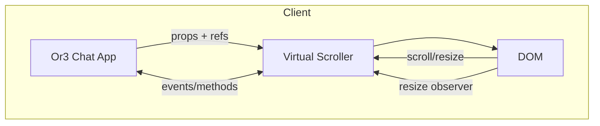
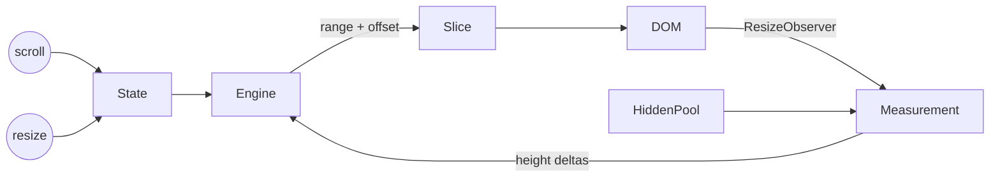
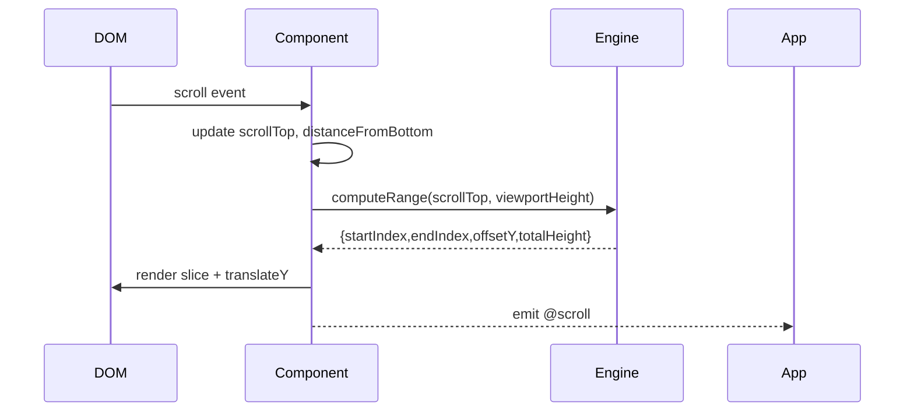
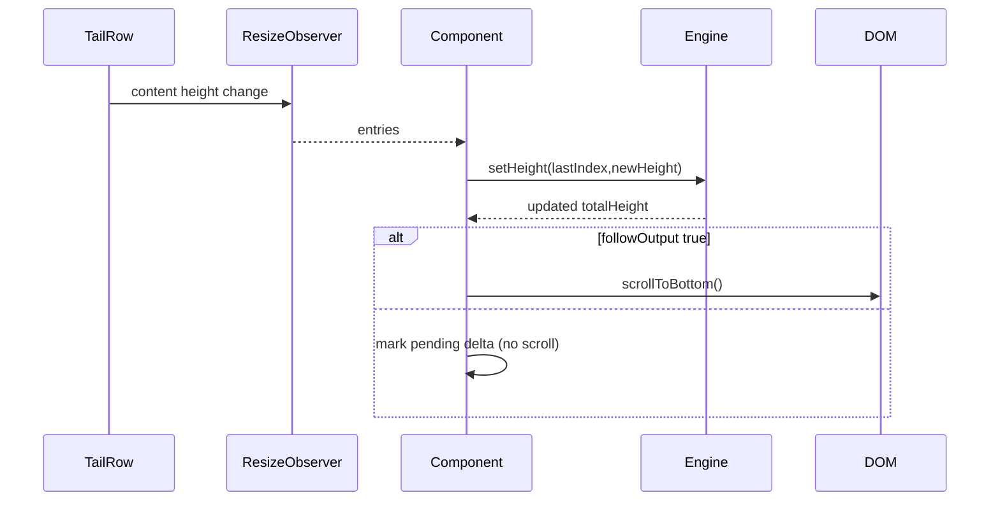
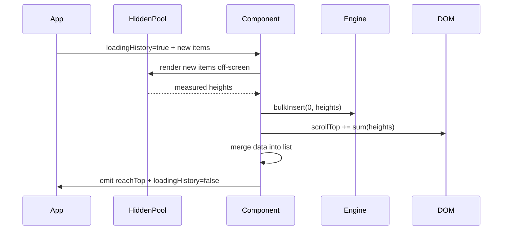

# Architecture: Or3 Chat Virtual Scroller

## 1. System Context

The virtual scroller mediates between the Or3 Chat application (data + interaction layer) and the browser (render + input layer). It consumes application-level `messages` and produces a smooth scroll experience tailored for AI chat. Upstream dependencies: host UI (Vue 3), data fetching services. Downstream dependencies: DOM, browser layout/scroll APIs, and `ResizeObserver`.



## 2. Logical Views

### 2.1 Component Decomposition

| Layer                 | Responsibility                                                           | Key Artifacts                             |
| --------------------- | ------------------------------------------------------------------------ | ----------------------------------------- |
| Presentation          | Vue component, slots, exposed methods                                    | `Or3Scroll.vue`, CSS module               |
| State Management      | Tracks `scrollTop`, `isAtBottom`, `followOutput`, virtualization outputs | `useScrollState.ts`, `useVirtualSlice.ts` |
| Virtualization Engine | Prefix sums, binary searches, offset math                                | `VirtualizerEngine.ts`, `fenwick.ts`      |
| Measurement           | ResizeObserver lifecycle, hidden pool for prepends                       | `measurement.ts`, `HiddenPool.vue`        |

### 2.2 Data Flow



## 3. Runtime Views

### 3.1 Scroll Handling



### 3.2 Streaming Tail



### 3.3 History Prepend



## 4. State Machines & Anchoring

### 4.1 Follow Output State Machine

| State       | Entry Conditions                                           | Exit Conditions                                            | Actions                                                    |
| ----------- | ---------------------------------------------------------- | ---------------------------------------------------------- | ---------------------------------------------------------- |
| `FOLLOWING` | `distanceFromBottom ≤ threshold` AND `maintainBottom` true | User scrolls up beyond threshold OR `maintainBottom` false | Auto-scroll on new content, observe tail                   |
| `DETACHED`  | User scrolled up or `followOutput` toggled                 | User re-enters threshold OR calls `scrollToBottom`         | Stop auto-scroll, optionally display CTA (handled by host) |

### 4.2 Measurement Scheduler

-   Collects RO entries keyed by index.
-   Uses `requestAnimationFrame` to batch updates, ensuring ≤1 engine recompute per frame.
-   During touch drag, compensation is deferred until `touchend` to avoid fighting native momentum.

## 5. Physical / Deployment View

-   Packaged as `@or3/chat-scroller` (placeholder) with peer dependency `vue@^3.4`.
-   Build artifacts: `dist/index.mjs`, `dist/index.cjs`, `dist/index.d.ts`, `dist/style.css`.
-   Optional headless export `VirtualizerEngine` for custom renderers.
-   Bundled styles limited to scroll container classes; applications may theme message rows themselves.

## 6. Cross-Cutting Concerns

-   **Performance**: typed arrays for height cache, single `transform` per slice, **pixel-based** overscan defaults tuned for mobile, binary search for range lookup.
-   **Accessibility**: component applies `role="list"` (configurable) and leaves keyboard interactions untouched; host content remains semantic.
-   **Observability**: dev-mode warnings for missing keys, RO failures, repeated measurement loops; optional `__debug` slot exposes internal state.
-   **Security**: component never evals strings or manipulates message content; all HTML is supplied by host slot.
-   **Memory**: height caches remain simple numeric arrays without eviction logic; hosts reclaim memory by calling `refreshMeasurements` if they aggressively recycle data.

## 7. Integration Guidelines

-   Provide stable `itemKey` resolving to unique IDs to minimize DOM churn.
-   Wrap message rows in single block element to give ResizeObserver predictable targets.
-   Use `loadingHistory` + `@reachTop` contract to coordinate fetch → measure → prepend lifecycle.
-   For multi-stream LLM responses, set `tailCount` accordingly so engine keeps final items rendered.
-   Adjust the `estimateHeight` prop when your message composition changes; the engine purposely avoids auto-tuning to stay deterministic.
-   Surface custom loading states through the existing `prepend-loading` slot; the core intentionally ships no skeleton component to stay lightweight.

## 8. Repository Layout Reference

```
src/
├── index.ts                 # Public API exports component + engine
├── components/
│   └── Or3Scroll.vue        # Template + scroll container
├── composables/
│   ├── useScrollState.ts    # followOutput, thresholds
│   └── useVirtualSlice.ts   # glue between Vue + engine
├── core/
│   ├── VirtualizerEngine.ts # math-only engine
│   └── fenwick.ts           # prefix sum helper
├── measurement/
│   ├── resizeObserver.ts    # shared RO instance
│   └── hiddenPool.ts        # off-screen measurement utilities
└── styles/
        └── or3-scroll.css       # container + track classes
```

## 9. Future Extensibility

-   Focus on documentation-driven customization (e.g., richer `prepend-loading` slot patterns) instead of bundling built-in skeleton DOM.
-   Keep overscan configuration pixel-based; revisiting item-count semantics only if real-world telemetry shows a gap.
-   Expose SSR helpers that precompute offset ranges using `estimateHeight` for first paint stability.
